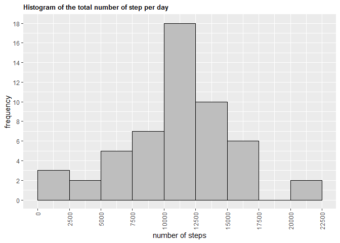

The purpose of this assignment is to answer the questions given below.

The data for this assignment comes from a personal activity monitoring device,
which collected data on the number of steps taken at 5 minute intervals 
throughout the day from October 01 to November 30 of 2012. 

In order to access the data set I forked the repository in GitHub (to access the
repository follow the [URL](https://github.com/rdpeng/RepData_PeerAssessment1))
and made a clone of it by creating a new project in R Studio.


## Loading and preprocessing the data
First, I have loaded the packages that will be needed for data manipulation and
making plots. Then, I unzipped the **activity.zip** file using unzip() function
and read the **activity.csv** file into R by read.csv() function and assigned it
to the *activity* variable.


```r
library(dplyr)
```

```
## 
## Attaching package: 'dplyr'
```

```
## The following objects are masked from 'package:stats':
## 
##     filter, lag
```

```
## The following objects are masked from 'package:base':
## 
##     intersect, setdiff, setequal, union
```

```r
library(lattice)
library(ggplot2)
unzip("activity.zip")
activity <- read.csv("activity.csv")
dim(activity)
```

```
## [1] 17568     3
```

```r
head(activity)
```

```
##   steps       date interval
## 1    NA 2012-10-01        0
## 2    NA 2012-10-01        5
## 3    NA 2012-10-01       10
## 4    NA 2012-10-01       15
## 5    NA 2012-10-01       20
## 6    NA 2012-10-01       25
```

From the output of dim() function it can be seen that the loaded data set has
17 568 observations and 3 variables. The result of the head() function gives the
names of the variables which are *steps*, *date*, and *interval*.


## What is mean total number of steps taken per day?
First, let's calculate the total number of steps taken each day. At this step
the missing values (NA) are ignored.

```r
totalnumber <- activity %>% group_by(date) %>% summarise(sum(steps)) 
```

```
## `summarise()` ungrouping output (override with `.groups` argument)
```

```r
# Here, I could also use the expression aggregate(steps~date,activity,sum)
colnames(totalnumber) <- c("day", "numberofsteps")
head(totalnumber)
```

```
## # A tibble: 6 x 2
##   day        numberofsteps
##   <chr>              <int>
## 1 2012-10-01            NA
## 2 2012-10-02           126
## 3 2012-10-03         11352
## 4 2012-10-04         12116
## 5 2012-10-05         13294
## 6 2012-10-06         15420
```
Let's now make the histogram of the total number of steps taken each day.

```r
ggplot(totalnumber, aes(numberofsteps))+ 
        geom_histogram(boundary=0, binwidth=2500, col = "black", fill="grey")+
        ggtitle("Histogram of the total number of step per day")+
        xlab("number of steps")+ylab("frequency")+
        theme(plot.title=element_text(face="bold",size=10),
              axis.text.x=element_text(angle=90,vjust=0.5,hjust=1))+
        scale_x_continuous(breaks=seq(0,25000,2500))+
        scale_y_continuous(breaks=seq(0,20,2))
```

```
## Warning: Removed 8 rows containing non-finite values (stat_bin).
```

<!-- -->

Let's now find the mean and the median total number of steps per day.

```r
mean(totalnumber$numberofsteps, na.rm = TRUE)
```

```
## [1] 10766.19
```

```r
median(totalnumber$numberofsteps, na.rm = TRUE)
```

```
## [1] 10765
```
Therefore, as can be seen from above the mean and the median of the total number 
of steps per day are **10766.19** and **10765** respectively.


## What is the average daily activity pattern?
Here, a time series plot of the average number of steps per intervals will be
plotted. (5-minute intervals on x-axis and the average number of steps averaged
across all days on y-axis)

```r
ANS <- activity %>% group_by(interval) %>% summarise(mean(steps, na.rm=TRUE))
```

```
## `summarise()` ungrouping output (override with `.groups` argument)
```

```r
colnames(ANS) <- c("interval", "meanstep")
with(ANS,plot(x = interval,y = meanstep,type = "l", xlab = "time intervals",
              ylab = "average number of steps",
              main = "Average number of steps per intervals"))
```

<!-- -->

```r
ANS %>% filter(meanstep==max(meanstep))
```

```
## # A tibble: 1 x 2
##   interval meanstep
##      <int>    <dbl>
## 1      835     206.
```
The last expression in the code chunk with filter() function gives us the 5-min
interval which contains the maximum number of steps.


## Imputing missing values
First let's calculate the number of missing values in the data set.

```r
sum(is.na(activity$steps))
```

```
## [1] 2304
```
Therefore, there are **2304** missing values (NAs) in the data set.
For replacing the missing values in the data set I used the mean total number of
steps from the *activity* data frame above.
Then I created a new data set which is equal to the original data set but with 
the missing values filled in.


```r
filler <- mean(activity$steps, na.rm = TRUE)
na <- is.na(activity$steps)
activity_imputed <- activity # creating a new data set
activity_imputed[na, 1] <- filler # filling in the missing values
totalnumber_imputed <- aggregate(steps ~ date, activity_imputed, sum)
colnames(totalnumber_imputed) <- c("day", "numberofsteps")
head(totalnumber_imputed)
```

```
##          day numberofsteps
## 1 2012-10-01      10766.19
## 2 2012-10-02        126.00
## 3 2012-10-03      11352.00
## 4 2012-10-04      12116.00
## 5 2012-10-05      13294.00
## 6 2012-10-06      15420.00
```
From the output of the head() function it can be seen now that the data set is
full and there are no NA values.
Let's now remake the histogram of the total number of steps per day given the 
new full data set.


```r
ggplot(totalnumber_imputed, aes(numberofsteps))+ 
        geom_histogram(boundary=0, binwidth=2500,col="darkblue",fill="blue")+
        ggtitle("Histogram of the total number of step per day")+
        xlab("number of steps")+ylab("frequency")+
        theme(plot.title=element_text(face="bold",size=10),
              axis.text.x=element_text(angle=90,vjust=0.5,hjust=1))+
        scale_x_continuous(breaks=seq(0,25000,2500))+
        scale_y_continuous(breaks=seq(0,26,2))
```

<!-- -->

Let's now recalculate the mean and the median total number of steps per day.

```r
mean(totalnumber_imputed$numberofsteps, na.rm = TRUE)
```

```
## [1] 10766.19
```

```r
median(totalnumber_imputed$numberofsteps, na.rm = TRUE)
```

```
## [1] 10766.19
```
Therefore, it can be seen that the mean value did not change after imputing
because the missing values have been replaced by the mean total number of steps
from the original data set. The median value slightly increased.


## Are there differences in activity patterns between weekdays and weekends?
For this part of the assignment the new full data set has been used.
First, the class of the *date* variable has been transformed to the Date class
using the as.Date() function. Then, a new variable *weekday* has been added,
which signifies corresponding day of the week. After this, a new factor variable
*daytype* has been created using the ifelse() function. This factor variable 
indicates whether the given date is weekday or week-end.

```r
activity_imputed$date <- as.Date(activity_imputed$date, format = "%Y-%m-%d")
activity_imputed$weekday <- weekdays(activity_imputed$date)
activity_imputed$daytype<-ifelse(activity_imputed$weekday=="Saturday" | 
                        activity_imputed$weekday=="Sunday","Week-end","Weekday")
head(activity_imputed)
```

```
##     steps       date interval weekday daytype
## 1 37.3826 2012-10-01        0  Monday Weekday
## 2 37.3826 2012-10-01        5  Monday Weekday
## 3 37.3826 2012-10-01       10  Monday Weekday
## 4 37.3826 2012-10-01       15  Monday Weekday
## 5 37.3826 2012-10-01       20  Monday Weekday
## 6 37.3826 2012-10-01       25  Monday Weekday
```

```r
ANSbydaytype <- aggregate(formula=steps~interval+daytype,data=activity_imputed,
                        FUN = mean,na.action=na.omit)
```

After finding the average number of steps taken per interval, averaged across 
all weekday days or weekend days, let's make a time series plot.


```r
xyplot(steps~interval|daytype,ANSbydaytype,type="l",layout=c(1, 2),
       xlab="interval", ylab = "number of steps", 
       main="Average number of steps per intervals by Day Type")
```

<!-- -->

On x-axis there are 5-minute intervals, and on the y-axis - the average number
of steps averaged across all weekdays and week-ends.
